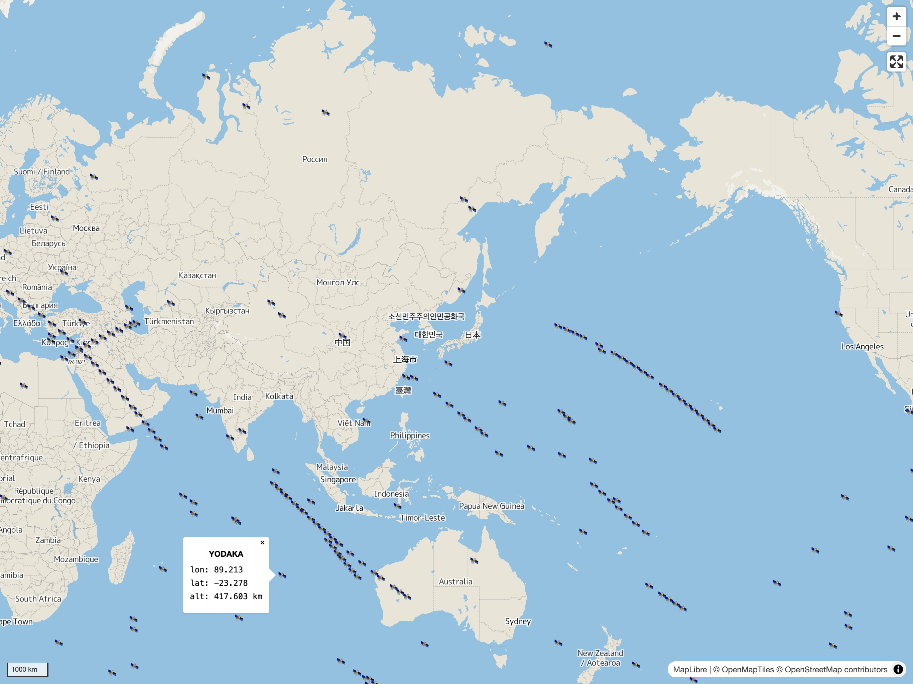

# 🛰️ react-sat-map

React components for visualizing real-time satellite locations on a map.

This package is built on [React](https://react.dev/), [react-map-gl](https://visgl.github.io/react-map-gl/), [MapLibre GL JS](https://maplibre.org/maplibre-gl-js/docs/), and [satellite.js](https://github.com/shashwatak/satellite-js).

## Demo

Check out the demo: https://sankichi92.github.io/react-sat-map/

[](https://sankichi92.github.io/react-sat-map/)

The demo showcases satellites from the ["Last 30 Days' Launches" TLEs on CelesTrak](https://celestrak.org/NORAD/elements/gp.php?GROUP=last-30-days&FORMAT=tle), retrieved during [the last build](https://github.com/sankichi92/react-sat-map/deployments/github-pages).

## Installation

```console
$ npm install react-sat-map
```

## Usage

The primary component of this library is `SatelliteMarkers`.
You can use it within the `Map` component provided by `react-map-gl/maplibre`.
Pass an array of satellite names and TLEs as the `satellites` prop.

Here’s an example:

```jsx
import { Map } from "react-map-gl/maplibre";
import { SatelliteMarkers } from "react-sat-map";
import "maplibre-gl/dist/maplibre-gl.css";
import "react-sat-map/style.css";

const satellites = [
  {
    name: "ISS (ZARYA)",
    tle: {
      line1:
        "1 25544U 98067A   24357.81415843  .00061122  00000+0  10662-2 0  9993",
      line2:
        "2 25544  51.6377 100.8061 0005268 355.1085 147.9826 15.50107458487805",
    },
  },
];

export default function App() {
  return (
    <Map
      style={{ height: "100dvh" }}
      mapStyle="https://demotiles.maplibre.org/style.json"
    >
      <SatelliteMarkers satellites={satellites} />
    </Map>
  );
}
```
